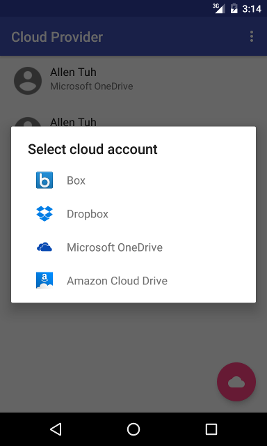
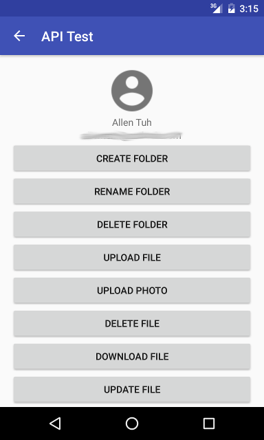
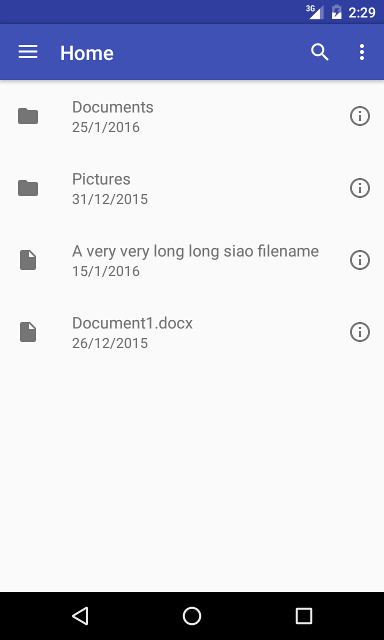
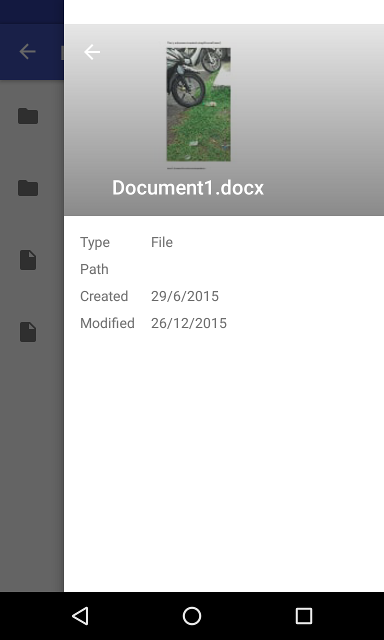

Cloud Provider Library
======================

The One Library that provide access to the most popular cloud storage services on Earth

One Library to rule them all, <br>
One Library to find them, <br>
One Library to bring them all into the control of the developers.

Cloud Services Supported
------------------------

* Box
* Dropbox
* Amazon Cloud Drive
* Microsoft OneDrive

Work in progress

* Yandex Disk
* Copy by Barracuda
* Digitalbucket
* Bitcasa


Release
-------
Version 0.1.0


Prerequisites
--------------
Android 2.3.3 (API Level 10) or higher

In order to use the cloud service APIs in this library, you need to register a developer account with each of the cloud service providers you choose to include in your app. Please follow the links below to setup your developer accounts.

1. [Box Developer](https://developers.box.com/)
2. [Dropbox Developer](https://www.dropbox.com/developers)
3. [Amazon Developer](https://developer.amazon.com/public/apis/experience/cloud-drive)
4. [Microsoft OneDrive API](https://dev.onedrive.com/index.htm)

After you setup a developer account, you will obtain the Client ID, Client Secret, and Redirect URL which you will need to assigned to the API class in the CloudProvider.


Quickstart
----------
Step 1: Add the library as a dependency in the module build.gradle file.
```groovy
dependencies {
    compile 'com.he5ed.lib:cloudprovider:0.1.0'
}
```

Step 2: Create a private.property file under the app module. Set the cloud accounts' Client ID, Client Secret, and Redirect URL. Use the template provided in [private.properties.sample](app/private.properties.sample). Just leave the properties value blank if the cloud service is not used.
```
box.client.id=your-client-id
box.client.secret=your-client-secret
box.redirect=your-redirect-uri
...
```
_This file must **NOT** be checked into Version Control Systems, as it contains information that must not be shared in public._


Step 3: Setup CloudProvider

Assign the Client ID, Client Secret, and Redirect URL to the cloud's API class. Follow the example code in the [MainActivity](app\MainActivity.java)
```
BoxApi.CLIENT_ID = BuildConfig.BOX_CLIENT_ID;
BoxApi.CLIENT_SECRET = BuildConfig.BOX_CLIENT_SECRET;
BoxApi.REDIRECT_URL = BuildConfig.BOX_REDIRECT_URL;
...

```

Change the account type name to your app's package name. There is a possibility that CloudProvider will mess up your accounts with other app that is also using this library without specifying a unique package name.
````
CloudProvider.ACCOUNT_TYPE = "your.app.package.name";
````

Instantiate the CloudProvider singleton and it is ready to rock 'n roll.
````
private CloudProvider mCloudProvider
....
mCloudProvider = CloudProvider.getInstance(this);
````

Add `CloudProvider.OnAccountChangeListener` to the CloudProvider to be notified if a new account has been added or removed.
````
private CloudAccount mAccount;
....
mCloudProvider.setAccountChangeListener(new CloudProvider.OnAccountChangeListener() {
            @Override
            public void onAccountRemoved(CloudAccount account) {
                // account has been remove, do something
            }

            @Override
            public void onAccountAdded(CloudAccount account) {
                // account has been added, do something
                mAccount = account;
            }
        });
````

Step 4: Provide user login using the build-in `AddAccountDialogFragment`
````
new AddAccountDialogFragment().show(getSupportFragmentManager(), AddAccountDialogFragment.class.getSimpleName());
````

or use the CloudProvider instance method `addAccount(String cloudApiName, Activity activity)`. The cloudApiName is the canonical name of the cloud API class.
````
mCloudProvider.addAccount(clazz.getCanonicalName(), getActivity());
````

Step 5: Build the cloud API class instance with the newly added account. User account can be retrieved from the `CloudProvider.OnAccountChangeListener` or directly calling the CloudProvider instance method `getAccountById(String id)` or `getCloudAccounts()`. The cloud API instance can be used to interact with cloud service backend.
````
private BaseApi mApi;
...
mApi = mCloudProvider.buildApi(mAccount);
````

Step 6: To provide user with the state-of-the art build-in cloud document picker, just start the `CloudPickerActivity` and pass in the extra value to the activity's intent.

To select a cloud file:
````
Intent fileIntent = new Intent(this, CloudPickerActivity.class);
startActivityForResult(fileIntent, REQUEST_PICK_FILE);
````

To select a cloud folder, set the extra value of the `CloudPickerActivity.EXTRA_PICK_FOLDER` to true.
````
Intent folderIntent = new Intent(this, CloudPickerActivity.class);
folderIntent.putExtra(CloudPickerActivity.EXTRA_PICK_FOLDER, true);
startActivityForResult(folderIntent, REQUEST_PICK_FOLDER);
````

Step 7: To received the selected cloud file or folder, just override the activity's `onActivityResult(int requestCode, int resultCode, Intent data)`.
````
@Override
protected void onActivityResult(int requestCode, int resultCode, Intent data) {
    // end if failure
    if (resultCode == Activity.RESULT_CANCELED)
        return;

    if (requestCode == REQUEST_PICK_FILE) {
        CFile file = data.getParcelableExtra(CloudPickerActivity.EXTRA_PICK_RESULT);
        // do something with the file

    } else if (requestCode == REQUEST_PICK_FOLDER) {
        CFolder folder = data.getParcelableExtra(CloudPickerActivity.EXTRA_PICK_RESULT);
        // do something with the folder

    }
}
````

Full java documentation is available [here](http://he5ed.github.io/cloudprovider/doc/index.html)

Sample App
----------
A sample app can be found in the [app](app) folder. The sample app demonstrates how to authenticate a user, view the user's cloud storage contains, and provide testing interface to test out all the functionality provided by CloudProvider.


Screenshots
-----------

 <br>
 <br>
 <br>


License
-------
    Copyright 2015 HE5ED.com

    Licensed under the Apache License, Version 2.0 (the "License");
    you may not use this file except in compliance with the License.
    You may obtain a copy of the License at

        http://www.apache.org/licenses/LICENSE-2.0

    Unless required by applicable law or agreed to in writing, software
    distributed under the License is distributed on an "AS IS" BASIS,
    WITHOUT WARRANTIES OR CONDITIONS OF ANY KIND, either express or implied.
    See the License for the specific language governing permissions and
    limitations under the License.